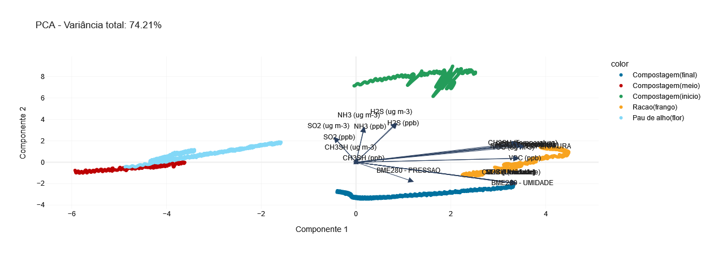
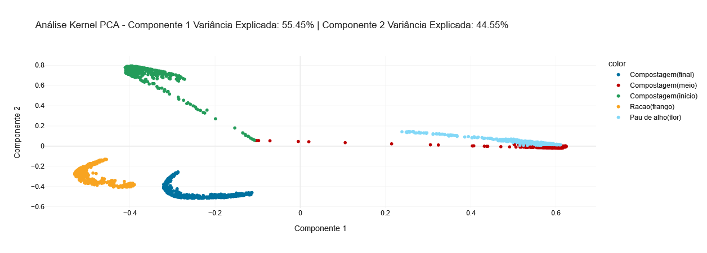
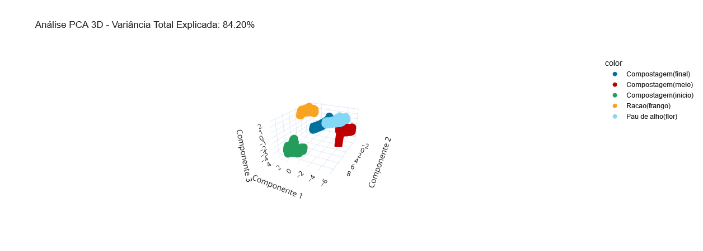
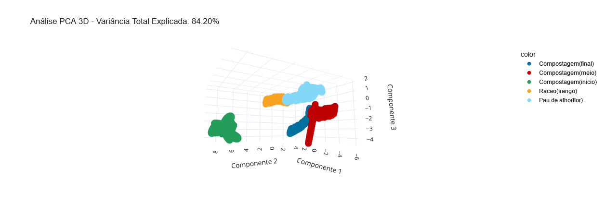
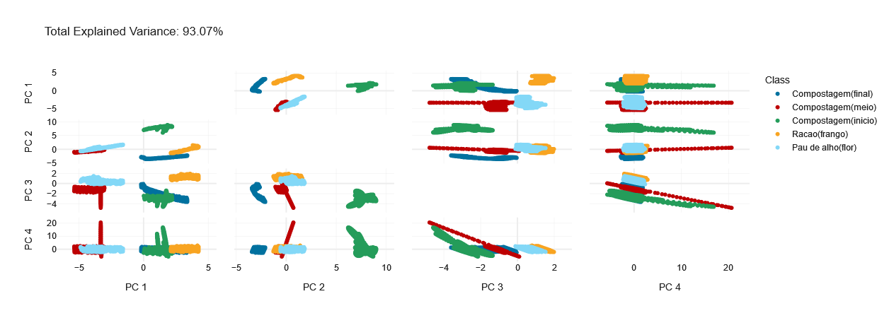
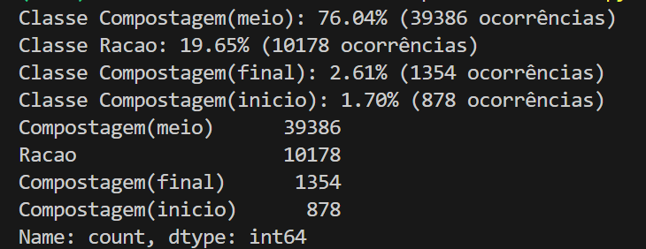
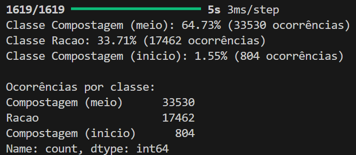
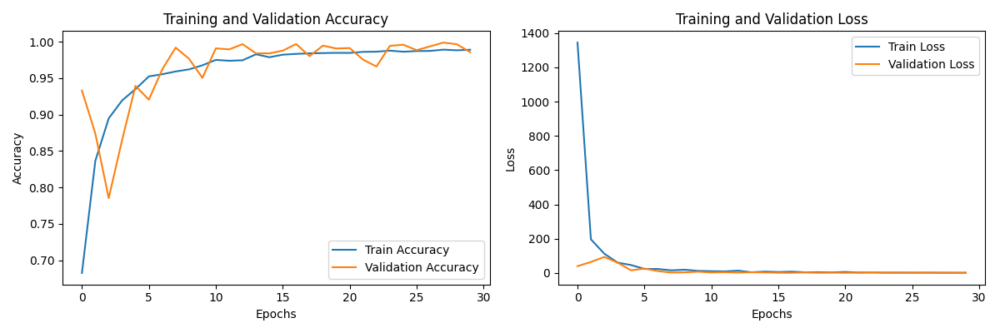

# PCA analysis

This project implements a Python-based Principal Component Analysis (PCA) calculation tool with interactive visualization using Dash. Additionally, the project includes a predictive model for datasets, allowing users to apply regression or classification to their data.

## Getting Started

Before you proceed, make sure to set up a virtual environment (venv) and install the required dependencies.

### Prerequisites

- Python 3.8 or later
- pip (Python package manager)

### Setup Instructions

1. **Create and activate a virtual environment**:
   ```bash
   python -m venv venv
   source venv/bin/activate  # On Windows, use venv\Scripts\activate

2. **Install the required dependencies**:
   ```bash
    pip install -r requirements.txt

3. **Run the application**:
    ```bash
    python app.py # On the root directory

4. **Open the application**:
    Open your browser and go to http:// as shown in the terminal.

5. **See model prediction**:
    ```bash	
    cd model && python predict.py || python kera_predict.py

---
## Understand the Graphics  

This section explains the concepts behind PCA and related techniques, accompanied by visual examples. All images are located in the `assets` folder.

### 1. Principal Component Analysis (PCA)

PCA is a dimensionality reduction technique that transforms high-dimensional data into a lower-dimensional space while preserving as much variance as possible. It identifies principal components, which are the directions of maximum variance in the data.


  

---

### 2. Kernel PCA (KPCA)

Kernel PCA extends PCA by applying the kernel trick, enabling the transformation of data into a higher-dimensional space before performing PCA. This is useful for capturing non-linear relationships in the data.

  

---

### 3. PCA in 3D

PCA can also be visualized in three dimensions to better understand how data points are distributed along the principal components. Below are two examples:
 
  

  

---

### 4. PCA's Explained Variance

Explained variance represents how much variance each principal component accounts for. It helps in deciding the number of components to retain for an effective dimensionality reduction.
 
  

---

By understanding these graphics, you can better interpret PCA results and choose the most appropriate approach for your data.

---

## About pre-processing

In this project, two distinct pre-processing steps were performed to prepare the datasets for PCA and predictive modeling. These steps ensure data consistency, remove noise, and focus the analysis on relevant features.

### Step 1: Column Renaming and Dataset Preparation

In the first pre-processing stage, we loaded the dataset, renamed its columns for better readability, and standardized the structure for further analysis.  

#### Code:
```python
    df = df.rename(columns={
        'D0': 'VOC (ppb)', 
        'D1': 'VOC (ug m-3)', 
        'D2': 'VOC (Temperature)', 
        'D3': 'VOC (Humidity)',
        'D4': 'H2S (ppb)', 
        'D5': 'H2S (ug m-3)', 
        'D6': 'H2S (Temperature)', 
        'D7': 'H2S (Humidity)',
        'D8': 'SO2 (ppb)', 
        'D9': 'SO2 (ug m-3)', 
        'D10': 'SO2 (Temperature)', 
        'D11': 'SO2 (Humidity)',
        'D12': 'NH3 (ppb)', 
        'D13': 'NH3 (ug m-3)', 
        'D14': 'NH3 (Temperature)', 
        'D15': 'NH3 (Humidity)',
        'D16': 'CH3SH (ppb)', 
        'D17': 'CH3SH (ug m-3)', 
        'D18': 'CH3SH (Temperature)', 
        'D19': 'CH3SH (Humidity)',
        'D26': 'BME280 - Temperature', 
        'D27': 'BME280 - Pressure', 
        'D28': 'BME280 - Humidity'
    })
```
### Step 2: Filtering and Class Balancing

In this step, a Butterworth low-pass filter was applied to reduce high-frequency noise in the odor data. Additionally, 30% of the initial data from each class was removed to eliminate outliers or unstable measurements at the beginning of each class.

#### Code:
```python
    fs = 100000.0  
    cutoff = 2000.0  
    order = 4  

    def butter_lowpass(cutoff, fs, order=5):
        nyq = 0.5 * fs
        normal_cutoff = cutoff / nyq
        b, a = butter(order, normal_cutoff, btype='low', analog=False)
        return b, a

    def lowpass_filter(data, cutoff, fs, order=5):
        b, a = butter_lowpass(cutoff, fs, order=order)
        return lfilter(b, a, data)

    df_filtered = df_main.copy()
    for col in df_filtered.columns[1:-1]:  
        df_filtered[col] = lowpass_filter(df_filtered[col], cutoff, fs, order)


    def remove_30_percent_start(df, class_name):
        class_data = df[df['Class'] == class_name]
        cutoff_index = int(len(class_data) * 0.3)
        return class_data.iloc[cutoff_index:]
```

## Odor prediction model
In this project, we developed two distinct models for odor prediction. The first one is based on a Random Forest Classifier, and the second on a Temporal Convolutional Network (TCN). Both models were trained on a dataset that contains different features related to the task. Below is an explanation of how each model was implemented and evaluated:

### 1. Random Forest Classifier Model

The first model employs a Random Forest Classifier to predict the odor class. Here's a breakdown of the process:

   - Dataset Loading and Preprocessing: The dataset is loaded and cleaned by removing unnamed columns and handling missing values. The features are selected from the dataset, and the labels are extracted.

   - Data Splitting: The dataset is split into training and testing sets using train_test_split. 80% of the data is used for training and 20% for testing.

   - Model Training with Hyperparameter Tuning: A Random Forest Classifier is trained using the training data, and hyperparameters are tuned using GridSearchCV. The parameters include the number of estimators, maximum depth of trees, and minimum samples required for splitting and creating leaf nodes.

- Evaluation: After training the model, it is evaluated on the test data. The model’s performance is reported using a confusion matrix and a classification report, which provides metrics such as precision, recall, and F1-score.

   - Model Saving: Once the best model is identified through grid search, it is saved to disk for future use using joblib.
 
  

### 2. Temporal Convolutional Network (TCN) Model

The second model is built using a Temporal Convolutional Network (TCN), a deep learning model suitable for sequential data. Here’s how it works:

- Dataset Loading and Preprocessing: Similar to the first model, the dataset is loaded and preprocessed. After cleaning the data, the features are selected, and the labels are encoded using LabelEncoder.

- Data Splitting: Again, the data is split into training and testing sets. The training and testing datasets are reshaped to match the input format expected by the TCN.

- TCN Model Construction: The TCN is defined with a specific architecture: it uses a temporal convolution layer followed by a dense layer for classification. The model is compiled using Adam optimizer and sparse categorical cross-entropy loss.

- Training and Evaluation: The model is trained for three epochs with a batch size of 32. After training, the model is evaluated using test data, and the loss and accuracy are printed.

    - Model Saving: After training, the model is saved to disk in .h5 format for future use.

  

- Here are the TCN model training graphs showing the accuracy and loss curves over 30 epochs
  

Both models, the Random Forest Classifier and the Temporal Convolutional Network, offer different approaches to solving the odor prediction problem, and their performances are evaluated based on accuracy and other classification metrics."